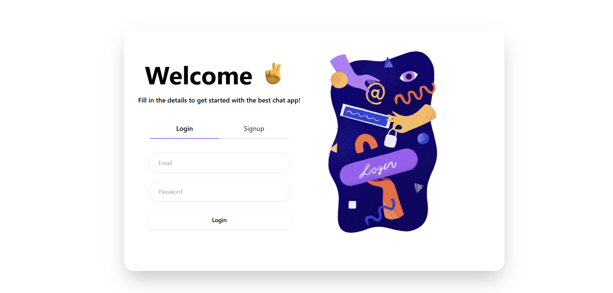
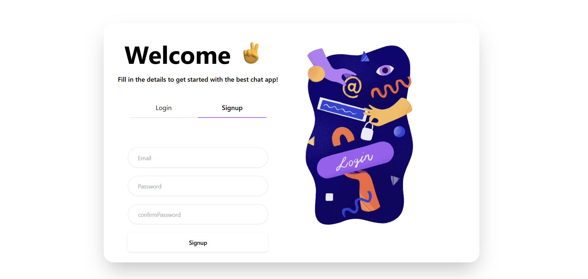
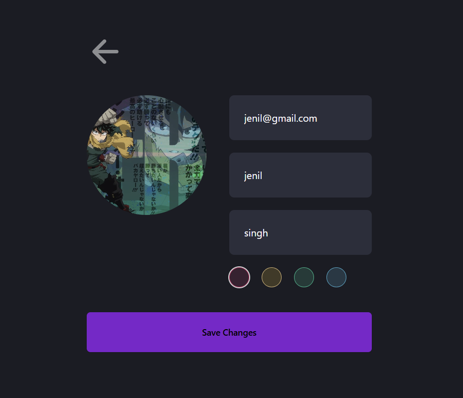
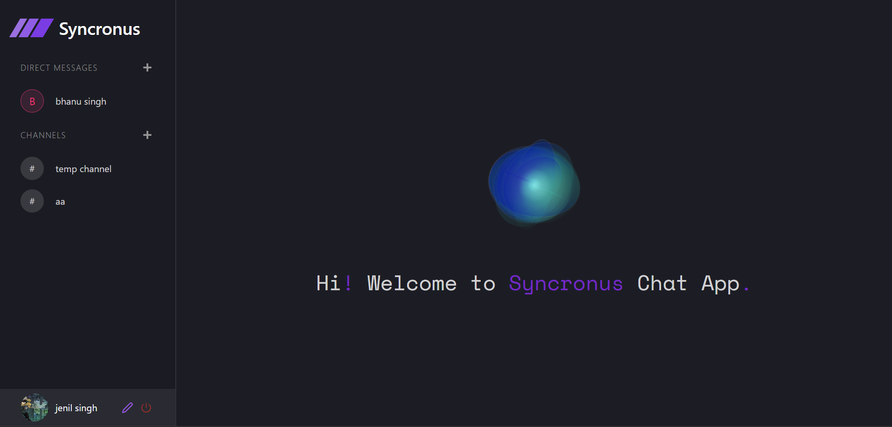
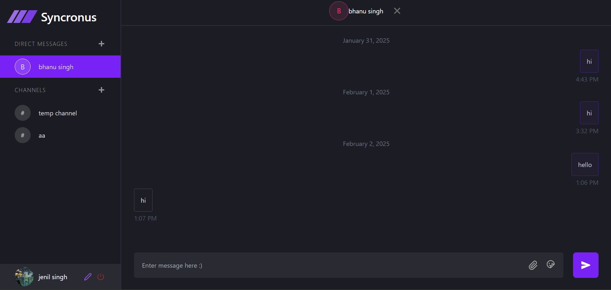
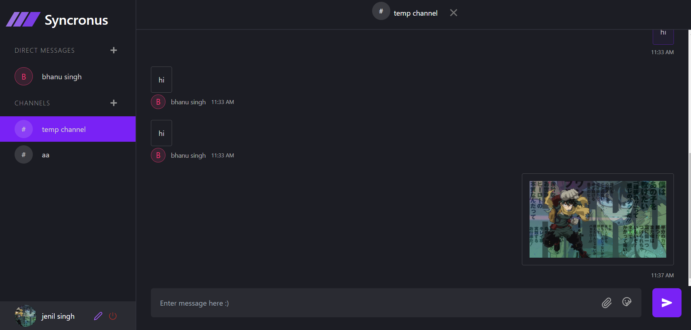

# **Chat Application** 💬  

A **real-time** chat application with **channels, direct messaging, file sharing, and authentication** built using **MERN Stack + Socket.io**.

---

## 🚀 **Features**  

✅ **User Authentication** (Signup/Login)  
✅ **Real-time Messaging** (1-on-1 & Channels)  
✅ **File Sharing** (Images & Documents)  
✅ **Profile Management**  
✅ **Message History & Persistence**  

---

## 🛠️ **Tech Stack**  

- **Frontend:** React, TailwindCSS, Zustand  
- **Backend:** Node.js, Express, MongoDB  
- **WebSockets:** Socket.io  
- **Authentication:** JWT (JSON Web Token)  

---

## 📸 **Screenshots**  

### **1️⃣ Login Page**  
 

### **1️⃣ Signup Page**  
 

### **1️⃣ Login Page**  
  

### **2️⃣ Chat Interface**  
  

### **3️⃣ One-to-one & DM List**  
  

### **3️⃣ Channel & DM List**  
  

 
 